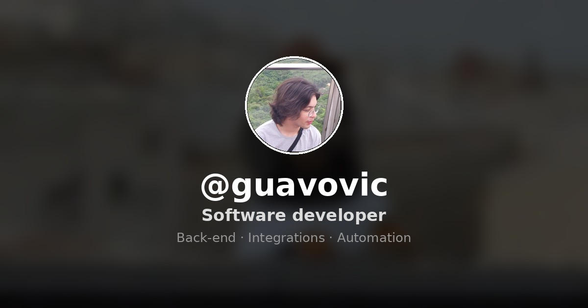

# guavovic-website

My personal website and link hub — a single, lightweight page built with plain HTML, CSS and JavaScript. No frameworks, no build step, just the platform.

🔗 **Live:** [guavovic.vercel.app](https://guavovic.vercel.app/)



## About

I'm Gustavo Victor, a software developer focused on back-end, integrations and automation. This is my corner of the internet: a fast, installable link hub that also happens to be full of small interactive details I built for fun. It doubles as a playground for vanilla-JS experiments — including three playable games hidden as easter eggs.

## Features

- **Live "now playing"** — pulls my current track from the Last.fm API, with a panel showing the week's top songs.
- **Progressive Web App** — installable and works offline via a service worker (cache-first assets, network-first config).
- **Ambient touches** — animated background video with parallax, subtle profile tilt, custom cursor glow, local time and weather, and a time-based greeting.
- **Seasonal mode** — a little snow in December.
- **Thoughtful details** — animated favicon that reacts to the now-playing state, playful browser-tab titles when you leave, and a message in the console for the curious.
- **Accessibility & performance minded** — respects `prefers-reduced-motion`, all Last.fm data is sanitized before rendering, and only one interactive overlay runs at a time.

## Easter eggs

Part of the fun is hidden. A few things to try:

- Type **`osu`** anywhere → a working **osu!mania 4K** rhythm game. Load your own `.osz` beatmaps (parsed locally with JSZip, stored in your browser via IndexedDB — nothing is uploaded) and play them with the `D F J K` keys.
- Type **`flappy`** → a full-screen Flappy Bird clone.
- Type **`dino`** → the Chrome dino runner, with cacti and flying obstacles.
- Open the browser console for a hello 👀

…and a couple more personal touches to stumble upon.

## Tech stack

- Vanilla **HTML / CSS / JavaScript** (no framework, no bundler)
- **Canvas 2D** + **Web Audio API** for the games and audio sync
- **JSZip** (loaded on demand) to read `.osz` beatmaps
- **IndexedDB** for local beatmap storage
- **Service Worker** + Web App Manifest for the PWA
- **Last.fm API** for listening data
- Deployed on **Vercel**

## Project structure

```text
src/
├── css/
│   └── styles.css          # All styles
├── images/                 # Profile, icons, PWA icons, preview
├── js/
│   ├── config.js           # Public config (Last.fm key, phrases, toggles)
│   ├── now-playing.js      # Last.fm now-playing + top tracks
│   ├── osu-mania.js        # osu!mania 4K game (type "osu")
│   ├── flappy.js           # Flappy Bird game (type "flappy")
│   ├── dino.js             # Dino runner (type "dino")
│   ├── weather.js          # Local weather
│   ├── seasonal.js         # December snow
│   └── …                   # cursor, tilt, favicon, greeting, etc.
├── videos/                 # Background video
├── index.html
├── manifest.json           # PWA manifest
└── sw.js                   # Service worker
```

## Running locally

There's no build step. Because of the service worker and the Web Audio API, serve it over HTTP rather than opening the file directly:

```bash
cd src
npx serve .          # or: python3 -m http.server
```

Then open the printed `localhost` URL. Hard-reload (`Ctrl+Shift+R`) after changes, since the service worker caches assets.

## A note on the code being public

This is a client-side site, so everything runs in the browser and is meant to be readable — that's the point of a portfolio. The only key in the code is a **read-only, public Last.fm API key**, which is safe to expose. No secrets or private credentials live in this repo.

## License

[MIT](LICENSE) © Gustavo Victor
